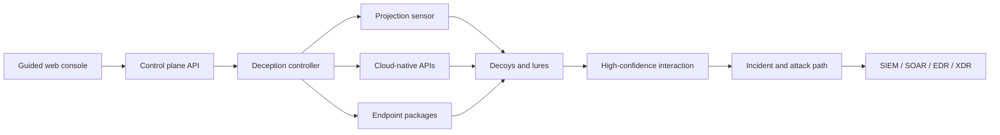

# AIDecepticon

**AI-native cyber deception, built in the open.**

AIDecepticon is an open-source control plane for designing, deploying, and operating defensive deception across identity, cloud, endpoints, internal networks, zero-trust access, and AI infrastructure. The product is intentionally GUI-first: common operator journeys are guided from intent to safe deployment without requiring a CLI.

> [!IMPORTANT]
> This repository is an operational product foundation, not yet a drop-in replacement for a mature commercial deception platform. The GUI, API, persistence layer, canary beacons, incident workflow, packaging, and projection-sensor MVP are implemented. Cloud-provider controllers, endpoint installers, and response-provider adapters are the next engineering layers described in [the roadmap](#roadmap).

## What is here

- A polished React operations console with guided mode, responsive layouts, and six complete product areas.
- A four-step deception deployment wizard with explicit placement, realism, lure, AI-adaptation, and containment controls.
- All eight required deception classes:
  - Threat intelligence decoys
  - Active Directory decoys
  - Cloud deception
  - Endpoint decoys
  - Man-in-the-middle attack deception
  - Internal decoys
  - Zero Trust decoys
  - AI infrastructure decoys
- Canary generation for fake files, credentials, cloud keys, API keys, and connections.
- A persistent REST control-plane API and downloadable OpenAPI 3.1 contract.
- Multi-domain AD posture, distributed sensor health, endpoint detection policy, and AI/agentic attack-sequence views.
- SIEM, SOAR, EDR, and XDR integration catalog and response workflow surfaces.
- Docker packaging with a persistent data volume.
- Optional bearer-token protection for every mutating control-plane API.
- A non-root Go projection sensor with one-time enrollment, signed commands, isolated HTTP/SSH/PostgreSQL/Redis/SMB/TCP decoys, and high-confidence telemetry.

## Product model



The intended architecture combines flexible on-premises, VM, rugged-edge, and SaaS deployment with a centralized controller and lightweight distributed projections. Decoys are designed to be non-pivotable: no production credentials, no trust into production, and outbound access denied by default.

## Quick start

Requirements: Node.js 24+ and npm 11+.

```bash
npm install
npm run dev
```

Open `http://127.0.0.1:4173`. The Vite development server proxies `/api` to the control plane on port `8787`.

For a production-style local build on Windows PowerShell:

```powershell
npm run build
$env:NODE_ENV='production'
$env:SENSOR_COMMAND_SIGNING_KEY='<at-least-32-random-bytes>'
npm start
```

Then open `http://localhost:8787`.

### Docker

```bash
export SENSOR_COMMAND_SIGNING_KEY="$(openssl rand -hex 32)"
docker compose up --build
```

The console and API are served at `http://localhost:8787`; state persists in the `aidecepticon-data` volume.

## Operator journey

1. Open **Command center** to review coverage, live signals, incident confidence, and sensor health.
2. Select **Deploy deception**. Guided mode walks through the target surface, placement, projection model, lure composition, realism, and guardrails.
3. Use **Deception mesh → Canary tokens** to generate an instrumented file, credential, connection, cloud key, or API secret.
4. Review touches in **Detections**, including the reconstructed sequence, confidence, MITRE ATT&CK mapping, and agentic-behavior assessment.
5. Connect the response path in **Integrations**, then manage identity domains, endpoint policies, and sensors under **Protected surfaces**.
6. Use **Platform & API** for health, governance, API examples, and the OpenAPI contract.

## API

The live contract is available at `/openapi.yaml`.

```bash
curl -X POST http://localhost:8787/api/v1/tokens \
  -H "Content-Type: application/json" \
  -d '{"name":"Quarterly plan","type":"document","destination":"Finance endpoints"}'
```

Set `CONTROL_PLANE_API_KEY` outside local development to require `Authorization: Bearer <key>` for token generation, deployments, and incident mutations. Canary beacon endpoints remain intentionally unauthenticated: accessing the unique URL is the detection signal.

Implemented resources include:

- `GET /api/v1/health` and `GET /api/v1/summary`
- `GET|POST /api/v1/deployments`
- `GET|POST /api/v1/tokens`
- `GET|PATCH /api/v1/incidents`
- `GET /api/v1/sensors`
- `POST /api/v1/sensor-enrollment-tokens`
- `POST /api/v1/sensors/enroll`
- `POST /api/v1/sensors/{sensorId}/heartbeat`
- `GET|POST /api/v1/sensors/{sensorId}/commands`
- `POST /api/v1/sensors/{sensorId}/commands/{commandId}/ack`
- `POST /api/v1/sensors/{sensorId}/events`
- `GET /api/v1/domains`
- `GET /api/v1/integrations`
- `GET|POST /api/v1/beacon/{tokenId}`

Projection sensors are enrolled entirely through **Protected surfaces → Add sensor**. The guided workflow creates a short-lived, single-use token and provides deployment commands. See [sensor/README.md](sensor/README.md) for the runtime security model and configuration reference.

## Development

```bash
npm run check
npm test
npm run build
```

The test suite verifies the command center, complete eight-class blueprint catalog, guided GUI deployment flow, enrollment lifecycle, command signing, sensor telemetry, and cross-language signing compatibility.

## Safety and scope

AIDecepticon is for authorized defensive security operations. Deception artifacts should never contain live credentials or grant production access. Deploy only into networks, directories, endpoints, and cloud accounts you are authorized to administer. See [SECURITY.md](SECURITY.md) for disclosure and deployment guidance.

## Roadmap

The complete milestone plan—including projection sensors, production control-plane work, endpoint delivery, SOC integrations, multi-domain AD, cloud controllers, decoy runtime breadth, AI/GenAI deception, and enterprise operations—is maintained in [ROADMAP.md](ROADMAP.md).

The active milestone is the projection-sensor MVP: secure enrollment, authenticated health and command channels, signed instructions, isolated decoy listeners, and interaction telemetry.

## License

MIT — see [LICENSE](LICENSE).
