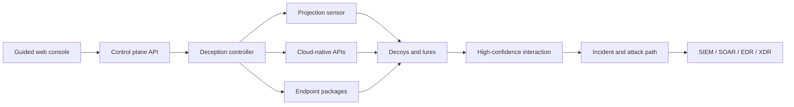

# AIDecepticon

**AI-native cyber deception, built in the open.**

AIDecepticon is an open-source control plane for designing, deploying, and operating defensive deception across identity, cloud, endpoints, internal networks, zero-trust access, and AI infrastructure. The product is intentionally GUI-first: common operator journeys are guided from intent to safe deployment without requiring a CLI.

> [!IMPORTANT]
> This repository is an operational product foundation, not yet a drop-in replacement for a mature commercial deception platform. The GUI, API, persistence layer, canary beacons, incident workflow, packaging, and projection-sensor MVP are implemented. Cloud-provider controllers, endpoint installers, and response-provider adapters are the next engineering layers described in [the roadmap](#roadmap).

## What is here

- A polished React operations console with guided mode, responsive layouts, and six complete product areas.
- A four-step deception deployment wizard with explicit placement, realism, lure, AI-adaptation, and containment controls.
- All eight required deception classes:
  - Threat intelligence decoys
  - Active Directory decoys
  - Cloud deception
  - Endpoint decoys
  - Man-in-the-middle attack deception
  - Internal decoys
  - Zero Trust decoys
  - AI infrastructure decoys
- Canary generation for fake files, credentials, cloud keys, API keys, and connections.
- A persistent REST control-plane API and downloadable OpenAPI 3.1 contract.
- Optional PostgreSQL persistence with ordered schema migrations and a Redis-compatible durable sensor-command queue.
- Bounded sensor-command retries with exponential backoff, scheduled acknowledgement recovery, and a GUI-operated dead-letter queue.
- Guided OIDC, SAML, or scoped API-key sign-in with server-side sessions, MFA-aware policy checks, and five enforceable RBAC roles.
- GUI-managed encrypted provider credentials using local AES-256-GCM, HashiCorp Vault Transit, or AWS KMS without plaintext list/read endpoints.
- Append-only HMAC-chained administrative audit events with sensitive-field redaction, PostgreSQL mutation guards, and continuous integrity verification.
- MSSP-ready organization isolation across control-plane data, sensors, encrypted secrets, commands, and tenant-filtered audit views, with a guided organization switcher.
- AES-256-GCM encrypted portable full-state backups with retention scheduling, authenticated integrity checks, automatic pre-restore checkpoints, JSON/PostgreSQL restore parity, and a guarded GUI workflow.
- PostgreSQL-backed controller membership and advisory-lock leader election with liveness/readiness probes, single-leader background jobs, graceful shutdown drain, and GUI-operated maintenance controls.
- Multi-domain AD posture, distributed sensor health, endpoint detection policy, and AI/agentic attack-sequence views.
- SIEM, SOAR, EDR, and XDR integration catalog and response workflow surfaces.
- Docker packaging with a persistent data volume.
- Optional bearer-token protection for every mutating control-plane API.
- A non-root Go projection sensor with one-time enrollment, signed commands, isolated HTTP/SSH/PostgreSQL/Redis/SMB/TCP decoys, and high-confidence telemetry.

## Product model



The intended architecture combines flexible on-premises, VM, rugged-edge, and SaaS deployment with a centralized controller and lightweight distributed projections. Decoys are designed to be non-pivotable: no production credentials, no trust into production, and outbound access denied by default.

## Quick start

Requirements: Node.js 24+ and npm 11+.

```bash
npm install
npm run dev
```

Open `http://127.0.0.1:4173`. The Vite development server proxies `/api` to the control plane on port `8787`.

For a production-style local build on Windows PowerShell:

```powershell
npm run build
$env:NODE_ENV='production'
$env:SENSOR_COMMAND_SIGNING_KEY='<at-least-32-random-bytes>'
$env:SECRET_LOCAL_KEYS='{"primary":"<base64-encoded-32-byte-key>"}'
$env:AUDIT_SIGNING_KEYS='{"primary":"<at-least-32-random-bytes>"}'
$env:BACKUP_ENCRYPTION_KEYS='{"primary":"<base64-encoded-32-byte-key>"}'
npm start
```

Then open `http://localhost:8787`.

### Docker

```bash
export SENSOR_COMMAND_SIGNING_KEY="$(openssl rand -hex 32)"
export SECRET_LOCAL_KEYS="{\"primary\":\"$(openssl rand -base64 32)\"}"
export AUDIT_SIGNING_KEYS="{\"primary\":\"$(openssl rand -base64 32)\"}"
export BACKUP_ENCRYPTION_KEYS="{\"primary\":\"$(openssl rand -base64 32)\"}"
docker compose up --build
```

The console and API are served at `http://localhost:8787`. Compose starts PostgreSQL 17 and Redis 8 with private persistent volumes; the control-plane port is bound to loopback only. Set `POSTGRES_PASSWORD` to override the local-only database default.

### Persistence and queue modes

With no infrastructure variables set, AIDecepticon uses its owner-readable JSON state file and persisted command records. This keeps local installation and development simple.

For fleet deployments, set `DATABASE_URL` and `REDIS_URL`. PostgreSQL becomes the source of truth for all resources and automatically applies the ordered migrations in `server/migrations`. Redis provides low-latency command delivery; queued commands remain recoverable from PostgreSQL if Redis is restarted or temporarily unavailable. Use `DATABASE_SSL=require` for a remote database and a `rediss://` URL for Redis over TLS.

Each sensor command is claimed for one delivery attempt. Failed or unacknowledged attempts are rescheduled with bounded exponential backoff; expired commands and commands that exhaust their attempt limit move to the dead-letter queue. Operators can review, retry as a new signed command, or dismiss those commands from **Protected surfaces → Command dead-letter queue**. `COMMAND_SCHEDULER_INTERVAL_MS` controls the recovery sweep interval and defaults to five seconds.

### Enterprise authentication and RBAC

Local development defaults to `AUTH_MODE=disabled` and uses a clearly identified local administrator. Production startup permits disabled authentication only for loopback URLs. Shared deployments must use OIDC, SAML, or a strong scoped API key, provide a random `SESSION_SECRET` of at least 32 bytes, configure HTTPS in `PUBLIC_BASE_URL`, and keep Redis enabled for revocable server-side sessions.

OIDC uses Authorization Code with PKCE, state, and nonce validation. SAML requires signed responses and assertions, validates `InResponseTo`, bounds clock skew and request lifetime, and publishes service-provider metadata at `/api/v1/auth/saml/metadata`. Set `AUTH_REQUIRE_MFA=true` with either `OIDC_REQUIRED_ACR`/accepted `amr` values or a trusted `SAML_MFA_ATTRIBUTE`.

`AUTH_ROLE_MAPPINGS` maps trusted IdP groups to `platform_admin`, `deception_engineer`, `analyst`, `auditor`, or `service`. Every management API route enforces its corresponding permission. A `CONTROL_PLANE_API_KEY` can also be limited with `CONTROL_PLANE_API_PERMISSIONS`; when external identity is disabled, operators can exchange that key for an HTTP-only GUI session on the guided sign-in screen.

### Organizations and MSSP isolation

Every tenant-owned record carries an immutable `organizationId`. The API resolves the active organization from `X-AIDecepticon-Organization`, verifies it against the authenticated identity, and applies the boundary inside both JSON and PostgreSQL storage operations. PostgreSQL also rejects attempts to remove or change a record's organization. Projection-sensor enrollment tokens carry the organization into the sensor identity, commands, telemetry, and derived incidents; secret encryption context and audit events are organization-bound as well.

Set `AUTH_ORGANIZATIONS_CLAIM` to the trusted OIDC/SAML claim containing organization IDs. Users without that claim receive only `AUTH_DEFAULT_ORGANIZATION_ID`; platform administrators can operate across organizations. Scope service credentials with `CONTROL_PLANE_API_ORGANIZATIONS`. Operators can create and switch organizations through **Platform & API → Organizations** without using the CLI.

### Encrypted secrets and audit integrity

**Platform & API → Secret vault** guides administrators through storing, rotating, and verifying integration, cloud, identity, response, and API credentials. Listing endpoints return only names, provider/key identifiers, and ciphertext fingerprints; no password-derived verifier is exposed. Verification decrypts inside the control plane and returns only an integrity result.

`SECRET_PROVIDER=local` uses AES-256-GCM with `SECRET_LOCAL_KEYS`; the first/selected `SECRET_LOCAL_KEY_ID` encrypts new values while retained IDs decrypt historical values. Set `SECRET_PROVIDER=vault-transit` with `VAULT_ADDR`, `VAULT_TOKEN`, and `VAULT_TRANSIT_KEY`, or `SECRET_PROVIDER=aws-kms` with `AWS_REGION` and `AWS_KMS_KEY_ID`. AWS credentials follow the SDK default credential chain, so workload identity is preferred.

Every administrative or response mutation is automatically redacted and appended to an HMAC-SHA256 hash chain. PostgreSQL deployments store these records in a dedicated table whose triggers reject update, delete, and truncate operations. `AUDIT_SIGNING_KEYS` supports verification across key rotation; keep historical key IDs available until their retention window ends.

### Backups and disaster recovery

**Platform & API → Backups & recovery** lets a platform-scoped operator create, validate, download, and restore encrypted recovery points without a CLI. Each archive contains a portable snapshot of every organization and the chronological administrative audit chain, compressed and authenticated with AES-256-GCM. Restore verifies the archive and audit chain first, pauses command delivery, creates an encrypted pre-restore checkpoint, applies the snapshot transactionally, and resumes delivery.

Set `BACKUP_ENCRYPTION_KEYS` to a JSON keyring of exactly 32-byte base64 or hex keys and select the writer with `BACKUP_ENCRYPTION_KEY_ID`. Keep retired keys available while their archives remain. `BACKUP_RETENTION_COUNT` defaults to 14; set `BACKUP_SCHEDULE_INTERVAL_HOURS` above zero for in-process scheduling. Store `BACKUP_DIR` on durable storage separate from the encryption keyring, copy archives off-host, and regularly use **Validate** plus a non-production restore drill. Backups preserve encrypted secret envelopes, so the corresponding secret-provider keys and historical audit signing keys are also required after recovery.

### Controller high availability

With PostgreSQL enabled, every controller registers its membership and competes for a session-level advisory lock. All ready replicas can serve API and GUI traffic, while exactly one leader runs command-recovery sweeps and scheduled backups. Sensor commands use transactional row locks and compare-and-set finalization so concurrent replicas cannot claim the same delivery or resurrect an acknowledged command. Redis remains shared delivery acceleration; PostgreSQL remains the coordination and durable state authority. JSON mode deliberately operates as one controller and reports `single-instance` in the topology.

Put `GET /api/v1/health/live` on the process-restart probe and `GET /api/v1/health/ready` on the load-balancer readiness probe. Before replacing a replica, route the operator to that instance and use **Platform & API → Controller topology → Drain traffic**. The controller immediately relinquishes leadership, stops leader-only schedulers, rejects new mutations, and returns 503 from readiness. After maintenance, **Resume instance** returns it to service. `SIGTERM` follows the same drain path and waits `SHUTDOWN_DRAIN_MS` before closing.

Give every replica a stable, unique `CONTROLLER_INSTANCE_ID` and optional `CONTROLLER_ZONE`/`CONTROLLER_ADVERTISE_URL`. All replicas must share PostgreSQL, Redis, the same cryptographic keyrings, and a durable `BACKUP_DIR`; keep at least two PostgreSQL pool connections available per replica because leadership holds one dedicated session. The current slice establishes safe coordination and operator controls. Multi-node deployment manifests plus certified rolling upgrade, rollback, load-balancer failover, and chaos tests remain roadmap work.

## Operator journey

1. Open **Command center** to review coverage, live signals, incident confidence, and sensor health.
2. Select **Deploy deception**. Guided mode walks through the target surface, placement, projection model, lure composition, realism, and guardrails.
3. Use **Deception mesh → Canary tokens** to generate an instrumented file, credential, connection, cloud key, or API secret.
4. Review touches in **Detections**, including the reconstructed sequence, confidence, MITRE ATT&CK mapping, and agentic-behavior assessment.
5. Connect the response path in **Integrations**, then manage identity domains, endpoint policies, and sensors under **Protected surfaces**.
6. Use **Platform & API** to protect provider credentials, inspect or drain controller replicas, verify the immutable administrative audit chain, and create or restore encrypted recovery points entirely through the GUI.

## API

The live contract is available at `/openapi.yaml`.

```bash
curl -X POST http://localhost:8787/api/v1/tokens \
  -H "Content-Type: application/json" \
  -H "X-AIDecepticon-Organization: org-default" \
  -d '{"name":"Quarterly plan","type":"document","destination":"Finance endpoints"}'
```

Set `CONTROL_PLANE_API_KEY` outside local development to require `Authorization: Bearer <key>` for token generation, deployments, and incident mutations. Canary beacon endpoints remain intentionally unauthenticated: accessing the unique URL is the detection signal.

Implemented resources include:

- `GET /api/v1/health`, `GET /api/v1/health/live`, `GET /api/v1/health/ready`, and `GET /api/v1/summary`
- `GET /api/v1/platform/instances`
- `POST /api/v1/platform/instances/current/drain`
- `POST /api/v1/platform/instances/current/resume`
- `GET|POST /api/v1/organizations`
- `GET|POST /api/v1/deployments`
- `GET|POST /api/v1/tokens`
- `GET|PATCH /api/v1/incidents`
- `GET /api/v1/sensors`
- `GET|POST /api/v1/secrets`
- `POST /api/v1/secrets/{secretId}/rotate`
- `POST /api/v1/secrets/{secretId}/verify`
- `GET /api/v1/audit-events`
- `GET|POST /api/v1/backups`
- `GET /api/v1/backups/{backupId}/download`
- `POST /api/v1/backups/{backupId}/validate`
- `POST /api/v1/backups/{backupId}/restore`
- `POST /api/v1/sensor-enrollment-tokens`
- `POST /api/v1/sensors/enroll`
- `POST /api/v1/sensors/{sensorId}/heartbeat`
- `GET|POST /api/v1/sensors/{sensorId}/commands`
- `POST /api/v1/sensors/{sensorId}/commands/{commandId}/ack`
- `POST /api/v1/sensors/{sensorId}/events`
- `GET /api/v1/domains`
- `GET /api/v1/integrations`
- `GET|POST /api/v1/beacon/{tokenId}`

Projection sensors are enrolled entirely through **Protected surfaces → Add sensor**. The guided workflow creates a short-lived, single-use token and provides deployment commands. See [sensor/README.md](sensor/README.md) for the runtime security model and configuration reference.

Version tags matching `v*` produce checksum-pinned Windows, Linux, and macOS sensor binaries, SPDX SBOMs, and GitHub/Sigstore provenance attestations.

## Development

```bash
npm run check
npm test
npm run test:e2e
npm run build
```

The test suite verifies the command center, complete eight-class blueprint catalog, guided GUI deployment, organization switching, tenant isolation, secret-vault flows, envelope encryption providers, HMAC audit integrity and redaction, encrypted backup tamper detection and JSON/PostgreSQL restoration, PostgreSQL leader election and drain failover, health probes, enrollment lifecycle, command signing, sensor telemetry, retry/dead-letter recovery, cross-language signing compatibility, migrations, and Redis-backed command delivery.

## Safety and scope

AIDecepticon is for authorized defensive security operations. Deception artifacts should never contain live credentials or grant production access. Deploy only into networks, directories, endpoints, and cloud accounts you are authorized to administer. See [SECURITY.md](SECURITY.md) for disclosure and deployment guidance.

## Roadmap

The complete milestone plan—including projection sensors, production control-plane work, endpoint delivery, SOC integrations, multi-domain AD, cloud controllers, decoy runtime breadth, AI/GenAI deception, and enterprise operations—is maintained in [ROADMAP.md](ROADMAP.md).

The active milestone is production control-plane hardening: observability plus multi-node deployment and zero-downtime upgrade certification on the completed HA coordination foundation.

## License

MIT — see [LICENSE](LICENSE).
